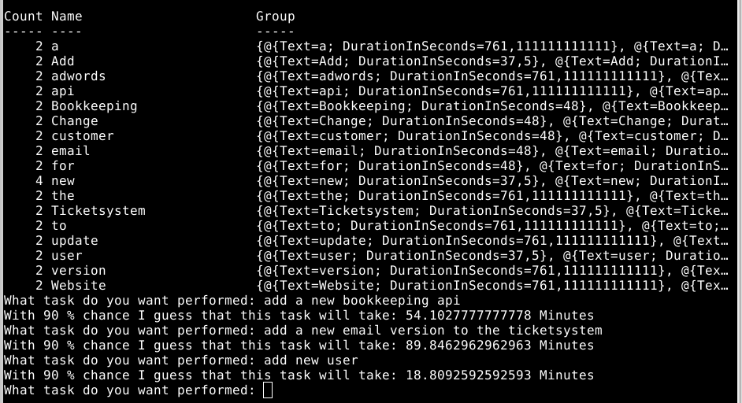

# Estimating Task Durations

Automatically

## The problem

When developing software you keep being asked "how long do you think that will take?". 

While this is a necessary thing for the business to know about which route to take it is also a disaster: 

- when guessing how long something will take we do not know a lot about the task
- we mostly forget about the context and
- we mostly forget other tasks that we still need to complete

... and many more.

And those numbers keep being thrown back at us "why isn't this complete yet" "you said four days, today is the fifth day, why..." and suddenly we are in a psychological trap as well which will haunt us and our colleges in the sleep and make us not wanting to guess anything anymore _ever_.

Still the business needs to ask. And still it remains a bad idea.

## The proposed solution

We take the recorded information about the tasks that we already have completed and split the task descriptions and the time alike using different algorithms.

Then we take a new task and split its description as well. Take 100 random numbers per word. Sort the durations per word, take the e.g. 90's value in the array (90% chance) and sum up the result.

So in theory we have a history based guess about how long the task will take. With 90% chance we think this task will take ... Minutes, Hours ... whatever.

This we can use to guess a big bunch of tasks at once. Feedback to the user: really fast. It is a guess, so it is wrong anyway. With more data it will probably become more correct. And it releaves us of the mean duty of guessing ourselfs.

Look yourself:

## More

Find a more complete documentation in the releases : https://github.com/stho32/Estimating-Task-Durations/releases/tag/latest

